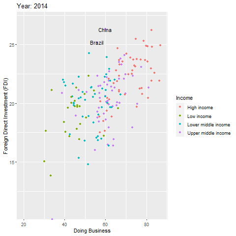

```{r setup, include=FALSE}
knitr::opts_chunk$set(echo = TRUE)

library(tidyverse)
library(janitor)
library(gganimate)
library(WDI)
library(gghighlight)
library(ggthemes)
library(kableExtra)

```

# Tratamento dos dados

Importou-se os dados de Ivestimento Estrangeiro Direto, coletados pelo FMI, com atuaização para o ano de 2018( em dólares).Em conjunto foram incorporadas as informações dos Relatórios Doing Business do Banco mundial. Todas as informações são do mesmo pacote.

Em relação as informações do Doing Business, como houve mudança de metodologia as informações estavam em bases diferente e também foram incorporadas a uma mesma base de dados

```{r message=FALSE, warning=FALSE}

#WDIsearch("Foreign direct investment")
#WDIsearch("Doing Business")

pdi_pib <- WDI( indicator = "BX.KLT.DINV.WD.GD.ZS")

FDI <- WDI( indicator = c("IC.BUS.EASE.DFRN.XQ.DB1719","IC.BUS.EASE.DFRN.DB16","IC.BUS.EASE.DFRN.DB15", "IC.BUS.EASE.DFRN.DB1014", "BX.KLT.DINV.WD.GD.ZS", "BX.KLT.DINV.CD.WD" ),start=2010, end= 2018, extra = TRUE)

FDI <- FDI %>% 
  rename(DB17_19 = IC.BUS.EASE.DFRN.XQ.DB1719, DB16 = IC.BUS.EASE.DFRN.DB16, DB15 = IC.BUS.EASE.DFRN.DB15, B10_14 = IC.BUS.EASE.DFRN.DB1014, fdi = BX.KLT.DINV.CD.WD, fdi_pib = BX.KLT.DINV.WD.GD.ZS)

# junção das metodologias, pois estavam em bases diferentes
FDI$metodologia <- coalesce(FDI$DB17_19,FDI$DB16)
FDI$metodologia2 <- coalesce(FDI$metodologia,FDI$DB15) 
FDI$db <- coalesce(FDI$metodologia2,FDI$B10_14)

FDI <- FDI %>% 
  select(iso2c, country, year,fdi_pib, fdi, iso3c, region, longitude, latitude, income, lending, db)

FDI_0 <- FDI %>%
    mutate(log_fdi = log(fdi), db = round(db,2)) %>% 
    filter(year >= 2014)

FDI <-  FDI %>%
  mutate(log_fdi = log(fdi), db = round(db,2)) %>% 
  filter(year >= 2014) %>% 
  na.omit()
  

```

# Tabela

Média da Pontuação do Indicador Por região. 

Observação: a Definição de Região foi estabelecida na própria base de dados fornecida

```{r message=FALSE, warning=FALSE}
tabela1 <- FDI %>%
  rename(`Região` = region) %>% 
  group_by(`Região`) %>% 
  summarise(` Média da Pontuação` = round(mean(db),2)) %>% 
  kable(caption = "Doing Business Por Região") %>% 
  kable_styling(bootstrap_options = c("striped", "hover"))

tabela1

```

  
  
# Gráficos de Dispersão com regressão
  
```{r fig.height=7, fig.width=10, message=FALSE, warning=FALSE}


FDI2018 <- FDI %>% 
  filter(year == 2018)


G0 <- FDI2018 %>% 
  ggplot(aes(x = db , y =log_fdi))+
  geom_smooth(method = "lm", se =  FALSE)+
  geom_point(aes(color = income))+
  labs(
    title = " Relação FDI e DB para o ano de 2018",
     x = 'Doing Business', 
     y = 'Foreign Direct Investment (FDI)',
     color= "Income"
     )+
  theme_hc()
  
G0


G1 <- FDI2018 %>% 
  ggplot(aes(x = db , y =log_fdi))+
  geom_smooth(method = "lm", se =  FALSE)+
  geom_text(aes(label=ifelse(country  %in% c("Brazil", "China", "India", "Russian Federation", "South Africa"),as.character(country),'')), color = "black", vjust = -1, hjust = 0)+
  geom_point(data=FDI2018[FDI2018$country %in% c("Brazil", "China", "India", "Russian Federation", "South Africa"),], size = 3)+
  geom_point(aes(color = income))+
  labs(
    title = "Relação FDI e DB para o ano de 2018",
    subtitle = "Países que Compõem os Brics",
     x = 'Doing Business', 
     y = 'Foreign Direct Investment (FDI)',
    color= "Income"
     )+
  theme_economist()
  
G1 


G2 <- FDI2018 %>% 
  ggplot(aes(x = db , y =log_fdi, color = country))+
  geom_point(size = 3)+
  gghighlight(country %in% c("Brazil", "China", "India", "Russian Federation", "South Africa"))+
  geom_smooth(method = "lm", se = FALSE)+
  labs(
    title = " Destaques Relação FDI e DB para o ano de 2018",
    subtitle = "Países que Compõem os Brics",
     x = 'Doing Business', 
     y = 'Foreign Direct Investment (FDI)'
    
     )
  
G2

G3 <- FDI %>% 
  filter(year == 2018) %>% 
  ggplot(aes(x = db , y =log_fdi, label = country ))+
  geom_smooth(method = "lm", se =  FALSE)+
   geom_point(aes(color = region), size = 3)+
  labs(
    title = "  Relação FDI e DB por região para o ano de 2018",
     x = 'Doing Business', 
     y = 'Foreign Direct Investment (FDI)',
     color= "Income"
     )+
  theme(legend.position =  "bottom")
  


G3


```


# Animação desde com indicadores desde o ano de 2014


```{r eval=TRUE, message=FALSE, warning=FALSE, include=FALSE, paged.print=FALSE}
###
G4 <-  FDI_0 %>% 
  filter(!is.na(region), region != "Aggregates") %>% 
   ggplot(aes(x = db , y =log_fdi, color = income))+
  geom_point()+
  transition_time(year) +
   geom_text(aes(label=ifelse(country  %in% c("Brazil", "China"),as.character(country),'')), color = "black")+
   labs(title = 'Year: {frame_time}', 
        x = 'Doing Business', 
        y = 'Foreign Direct Investment (FDI)',
        color= "Income"
        )+
  ease_aes('linear')


```



